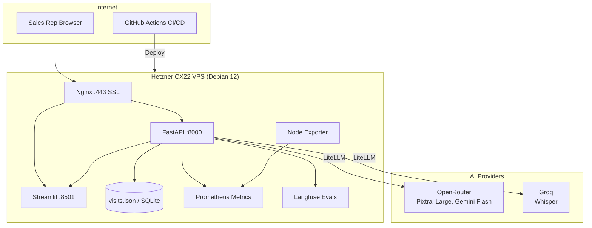

# INFRASTRUCTURE

This document describes how the Multimodal Visit Reporter would be taken
from the current MVP to a production deployment. It is a theoretical
design — no actual deployment is required — but is written with specific,
actionable choices.

---

## 1. Deployment target and reasoning

### Primary target: Hetzner Cloud VPS + Docker

**What:** A single Hetzner CX22 VPS (2 vCPU, 4 GB RAM, 40 GB SSD, €4/month) running Debian 12, with the application delivered as a Docker container via `docker compose`.

**Why Hetzner:**
- EU-based data centres (Nuremberg, Falkenstein, Helsinki) — satisfies GDPR data residency requirements out of the box.
- Unbeatable price-to-performance ratio for a small-scale internal tool.
- Clean API, Terraform support, and preemptible instances for staging environments.
- Predictable pricing (per hour/month, not per token) — no surprise bills from AI traffic spikes hitting the compute layer.

**Alternative: RunPod GPU pod (for self-hosted models)**

If the project later replaces cloud API calls with local models (e.g., Whisper.cpp for transcription, a quantised Mistral for extraction), RunPod provides GPU pods with predictable hourly pricing and a CLI (`runpodctl`). RunPod Secrets handles API key injection natively. A hybrid architecture — Hetzner for the FastAPI/Streamlit layer, RunPod for model inference — is also viable.

**Container strategy:**

```
Dockerfile
  FROM python:3.13-slim
  COPY . /app
  RUN pip install -r requirements.txt
  CMD ["sh", "-c", "uvicorn app.main:app --host 0.0.0.0 --port 8000 & streamlit run ui/app.py --server.port 8501 --server.address 0.0.0.0"]
```

For production, the API and UI would be separate containers in a `docker-compose.yml`, allowing independent scaling. A lightweight Nginx container would serve as reverse proxy with SSL termination via Let's Encrypt.

---

## 2. CI/CD pipeline

**From pull request to production:**

```
PR opened → GitHub Actions:
  1. Lint (ruff) and type-check
  2. Run pytest suite (unit tests for storage, JSON parser, AI pipeline with mocked LiteLLM responses)
  3. Build Docker image
  4. Push to GitHub Container Registry (ghcr.io) with tags :latest and :sha-<commit>

PR merged to main → GitHub Actions:
  5. Deploy to staging VM
  6. Smoke test: curl POST /api/visits/extract with a known text sample, verify 200 + valid JSON
  7. If smoke test passes: deploy to production VM
     - SSH into VM
     - docker compose pull
     - docker compose up -d
     - Health check: curl GET / (expect 200 within 10s) else rollback
```

**Rollback:** The previous image is tagged `:previous`. If health check fails, `docker compose up -d` with the `:previous` tag. Full rollback takes <30 seconds.

**Branch strategy:** `main` is production. Feature branches merge via PR with required CI pass. No direct pushes to `main`.

---

## 3. Secrets and configuration management

**Principle: secrets never touch source code.**

| Environment | Method |
|-------------|--------|
| Local development | `.env` file (gitignored), loaded via `python-dotenv` at application startup |
| CI/CD (GitHub Actions) | GitHub Secrets (`OPENROUTER_API_KEY`, `GROQ_API_KEY`, `HCLOUD_TOKEN`) injected as environment variables into the workflow |
| Production (Hetzner VM) | `.env` file on the VM with `chmod 600`, owned by the application user. Alternative: HashiCorp Vault (self-hosted on the same VM) for rotation and audit logging |
| Production (RunPod alternative) | RunPod Secrets — encrypted key-value pairs injected as environment variables into the pod at start time |
| Production (Azure alternative) | Azure Key Vault with managed identity — no keys in the container, accessed via `DefaultAzureCredential` |

**Rotation policy:** API keys rotated every 90 days. OpenRouter and Groq allow generating new keys while old ones remain active, enabling zero-downtime rotation.

---

## 4. Monitoring, logging, and alerting

### What to watch

| Metric | Tool | Why |
|--------|------|-----|
| Token spend per hour | LiteLLM callbacks → Prometheus | Cost control: detect runaway usage before the bill arrives |
| AI extraction latency (p50, p95, p99) | LiteLLM callbacks + FastAPI middleware | If p95 exceeds 15 seconds, something is wrong with the provider or the model |
| Error rate by model | LiteLLM callbacks → Prometheus | Track % of calls returning 4xx/5xx per model; early warning of provider issues |
| API endpoint health | Uptime monitor (e.g., HetrixTools, UptimeRobot) | Is the app reachable? |
| Container resource usage | Prometheus node exporter | CPU/RAM/disk saturation on the VM |
| JSON file integrity (if still file-based) | Cron job: `python -c "from app.services.storage import load_visits; load_visits()"` | Detect file corruption before users notice |
| Extraction quality drift | Langfuse (self-hosted or cloud) | Track JSON schema compliance, field presence, and sentiment distribution over time |

### What pages at 3 AM

1. **API health check fails** (the app is down).  
2. **Extraction error rate exceeds 10%** over a 5-minute window (provider outage or model deprecation).  
3. **Token spend exceeds daily budget by 20%** (prevent bill shock).  

### Logging

- Application logs: structured JSON via Python's `logging` module, shipped to stdout and captured by Docker's logging driver.
- AI interaction logs: every LiteLLM call is logged with model name, input token count, output token count, latency, and truncated response snippet (never full customer data). These are the audit trail for cost and quality.
- In production, ship logs to Grafana Loki or a simple `journald` setup for searchability.

---

## 5. Scaling considerations and likely bottlenecks

### Bottleneck 1: JSON file storage (concurrent writes)
**Impact:** Data corruption or lost visits under >1 concurrent user.  
**Fix:** Replace with SQLite (WAL mode) for 1–50 users. Beyond that, PostgreSQL with connection pooling. The `storage.py` interface is already abstracted — only that module changes.

### Bottleneck 2: AI provider rate limits
**Impact:** OpenRouter enforces rate limits per account. 50 sales reps extracting simultaneously could hit the cap.  
**Fix:** LiteLLM's built-in retry with exponential backoff. Add a fallback model list: if `openrouter/google/gemini-2.0-flash-001` is rate-limited, retry with `openrouter/mistralai/mistral-small`. LiteLLM's `fallbacks` parameter makes this a configuration change, not a code change.

### Bottleneck 3: Large file uploads (images, audio)
**Impact:** An 8 MB image is base64-encoded to ~11 MB in memory. Multiple concurrent uploads could exhaust RAM on a small VM.  
**Fix:** Stream to disk instead of holding in memory. Add file size limits (e.g., 25 MB) in the FastAPI endpoint. For images, add server-side resizing before sending to the vision model (Pillow can resize to 1024 px longest edge, reducing the payload 5–10x without meaningful quality loss).

### Scaling the application layer
- The FastAPI and Streamlit containers can be replicated behind a load balancer if needed.
- Stateless design (no in-memory session data that must persist across requests) makes horizontal scaling straightforward.
- Streamlit's session state is per-browser-tab and not shared, so multiple replicas work without sticky sessions for most flows.

---

## 6. AI-specific operational concerns

### Rate limits and cost tracking
- LiteLLM's callback system tracks token usage per call. In production, aggregate this into Prometheus metrics and set Grafana alerts on daily spend thresholds.
- OpenRouter shows usage in their dashboard; automate a daily Slack/email summary via their API.

### Fallback strategies
- **Model deprecation (already encountered):** When `mistralai/pixtral-12b` disappeared from OpenRouter, the fix was a one-string change to `pixtral-large-2411`. LiteLLM's unified interface meant zero other code changed.
- **Provider outage:** LiteLLM supports a `fallbacks` list — if the primary model fails, it automatically retries with the next. Example: `fallbacks=[{"openrouter/google/gemini-2.0-flash-001": ["openrouter/mistralai/mistral-small"]}]`.
- **Transcription fallback:** If Groq Whisper is unavailable, fall back to `openrouter/openai/whisper-1` (via OpenRouter, slightly slower but widely available).

### Prompt versioning
- Prompts are stored in `app/prompts.py` as pure functions returning strings. In production, move prompts to versioned files (e.g., `prompts/v1_system.txt`, `prompts/v2_system.txt`).
- Log which prompt version produced each extraction (add a `prompt_version` field to the Visit metadata or a separate telemetry table).
- Run weekly evaluations: feed a golden dataset of 20 known inputs through the pipeline, compare outputs against expected results, and alert on regression (e.g., field extraction accuracy drops below 95%).

### Handling provider outages
- The app already handles this gracefully: AI call failures are caught, logged, and returned as HTTP 422/500. The user sees a clear error, not a crash.
- For higher resilience: add a circuit breaker pattern — if a model fails 5 times in 60 seconds, stop calling it for 5 minutes and use the fallback model instead. LiteLLM's retry logic covers the first layer of this.
- Maintain a manual override: an environment variable `EXTRACTION_MODEL` that can be changed without redeploying (just restart the container) to switch all extraction to a backup provider.

### Model evaluation and quality monitoring
- **Langfuse** (open-source, self-hostable on the same Hetzner VM) provides LLM observability: trace every extraction, score outputs with LLM-as-a-judge, track cost, and monitor prompt versions.
- Run weekly evals comparing extraction output against a human-verified golden dataset. Track:
  - Field-level accuracy (is customer_name correct?)
  - JSON schema compliance (are all required fields present?)
  - Sentiment agreement (does the extracted sentiment match a human label?)
- These evals catch model drift before users notice.

---

## 7. Diagram: Production Architecture


